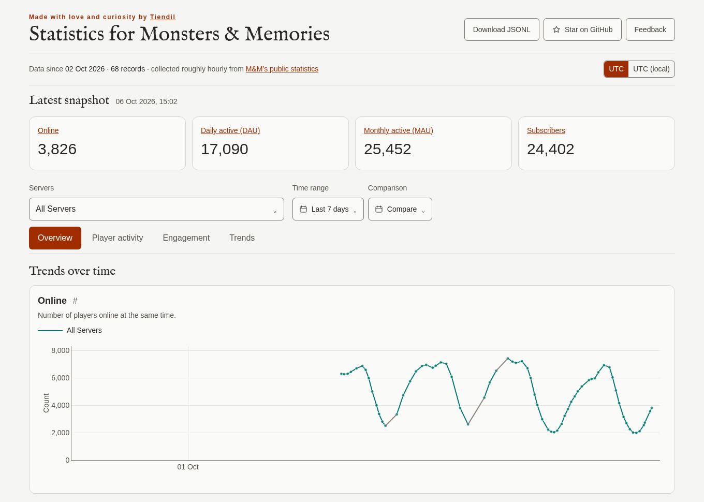

# Monsters & Memories Statistics

An unofficial dashboard of Monsters & Memories player activity. Historical charts, server comparisons, and activity trends, based on public statistics collected roughly hourly.

**[Open dashboard](https://tiendil.github.io/monsters-and-memories-stats/)** · [Download data](https://tiendil.github.io/monsters-and-memories-stats/history.jsonl) · [Suggest a feature or report a bug](https://github.com/Tiendil/monsters-and-memories-stats/issues/new/choose)

## Motivation

The Monsters & Memories developers [share their actual subscription numbers](https://account.monstersandmemories.com/metrics). That openness is valuable to the game development community: many of us dream of making an MMO, and real numbers give us something concrete to learn from.

Their statistics page shows the current state, but doesn't provide a lasting historical archive. I started collecting the data to preserve that history. One thing led to another, and the project grew into a dashboard with a few more charts to explore the game's population and activity.

## What's inside

- **Overview:** online players, daily and monthly activity, and subscribers.
- **Player activity:** server populations, starting areas, and activity by weekday and hour.
- **Engagement:** how online population, daily and monthly activity, and subscriptions relate to each other.
- **Trends:** server growth, busiest hours, and starting-area activity, with week, month, and year comparisons.

Compare servers and periods, switch between UTC and your local time, and share links to individual charts with your selections included. The latest snapshot stays visible above the charts, with its collection date and time.

## About the data

The archive uses [M&M's public statistics](https://account.monstersandmemories.com/metrics). Collection is approximately hourly, so gaps are possible; there is no history from before collection began. The download contains the complete collected archive, regardless of the dashboard's filters.

The [metric specifications](specs/requirements.md#metric-interpretation) describe the counts, calculations, and limitations.

## For contributors

See the [development workflow](specs/development.md), [architecture](specs/architecture.md), and [specification index](specs/intro.md).

Made with love and curiosity by [Tiendil](https://tiendil.org).
